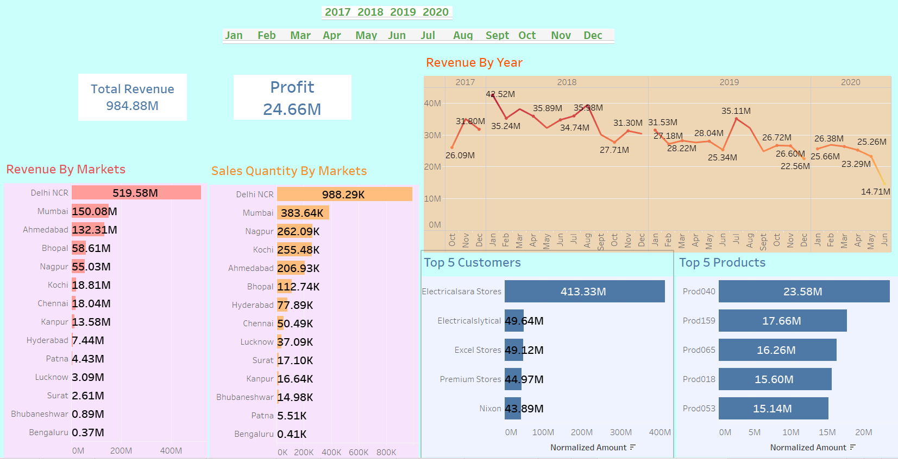
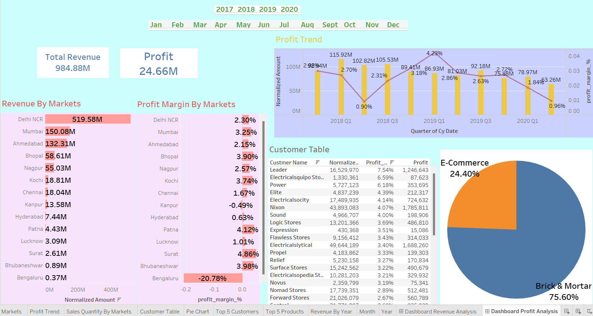

# Sales & Profit Analysis Dashboard

**Project Overview**:
- This project contains interactive Tableau dashboards created to analyze sales and profit data across multiple markets using data from a MySQL database. The dashboards provide insights into total revenue, profit margins, sales quantities, top-performing customers, and products.

**Contents**:
- `data/`: Contains the SQL dump file (db_dump_version_2.sql) used to extract the data for this project.
- `images/`: Includes screenshots of the Tableau dashboards.
- `wholedashboard_final.twbx`: Tableau packaged workbook containing the interactive dashboards.
- `README.md`: Overview of the project.

**Dashboard Features**:
- Revenue by Market: Visualization of revenue and sales quantity for different regions.
- Profit Trends: Displays profit trends over time.
- Top Customers & Products: Highlights top customers and products by sales and revenue.

  
## Tableau Dashboard Images

Revenue Analysis:

Profit Analysis:

